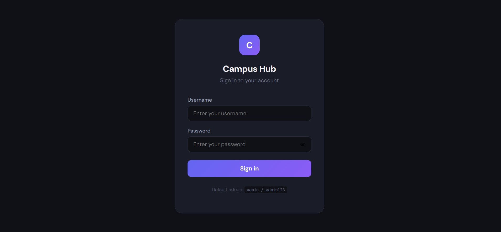
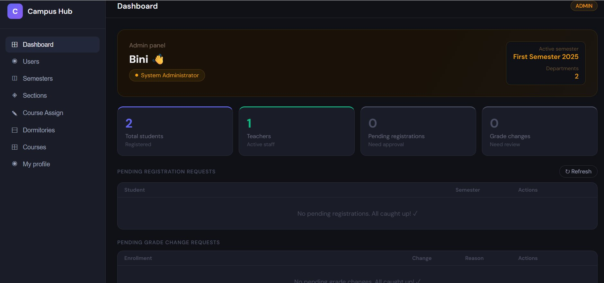
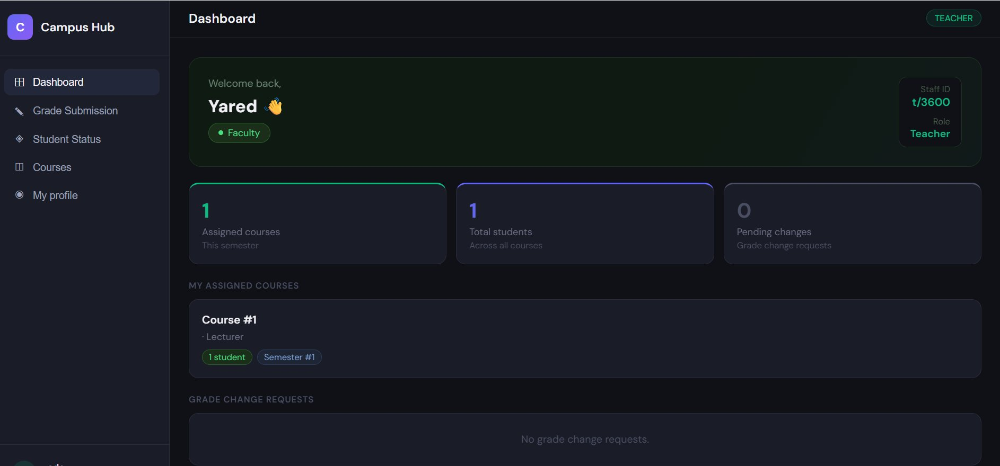
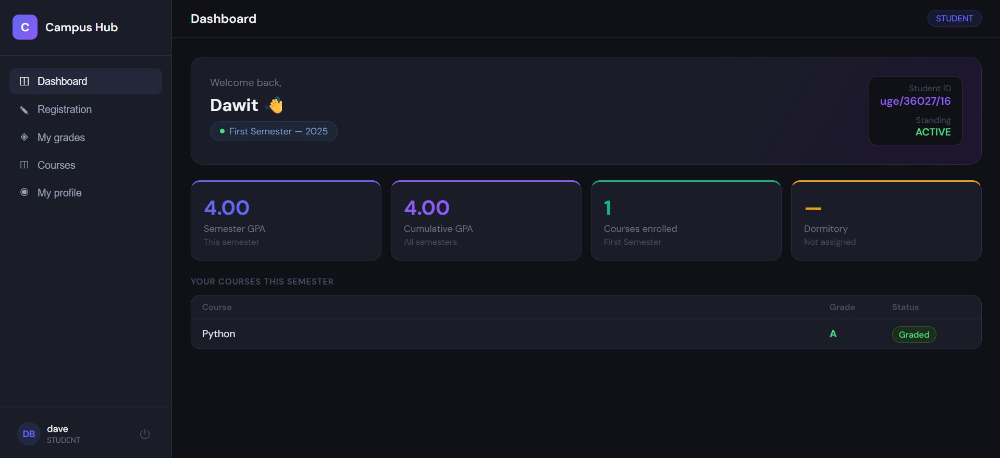
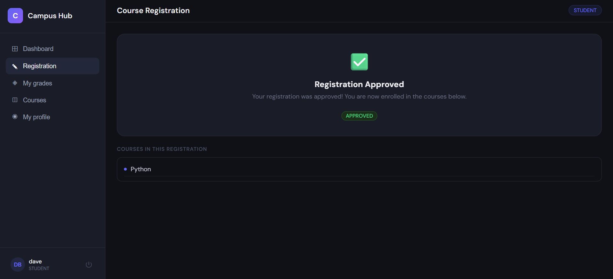
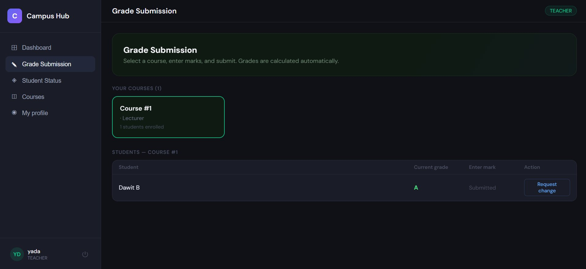

# Campus Hub

A full-stack university campus management system built with **Django REST Framework** and **React**. Designed to handle the complete academic lifecycle — from student registration and course enrollment to grade submission and dormitory management — with role-based access for students, teachers, and admins.

---

## Table of Contents

- [Overview](#overview)
- [Screenshots](#screenshots)
- [Features](#features)
- [Tech Stack](#tech-stack)
- [Project Structure](#project-structure)
- [Getting Started](#getting-started)
  - [Prerequisites](#prerequisites)
  - [Backend Setup](#backend-setup)
  - [Frontend Setup](#frontend-setup)
- [API Reference](#api-reference)
- [Role-Based Access](#role-based-access)
- [Academic Flow](#academic-flow)
- [Environment Variables](#environment-variables)

---

## Overview

Campus Hub is a management platform that mirrors real university workflows. An admin sets up semesters, departments, and courses. Students register for courses each semester. Admins approve registrations, which creates enrollments. Teachers submit grades. Academic standing is calculated automatically based on GPA rules.

Every piece of the system enforces business rules at the database level — not just in the frontend — making the platform robust and consistent regardless of how data enters the system.

---

## Screenshots

### Login


### Admin Dashboard


### Teacher Dashboard


### Student Dashboard


### Course Registration


### Grade Submission


---

## Features

### Student
- Register for courses each semester (one registration per semester enforced)
- View registration status (Pending / Approved / Rejected)
- Re-register after rejection
- Browse course catalog filtered by department
- View grades per semester with GPA tracking
- View cumulative GPA and academic standing (Active / Probation / Dismissed)
- View assigned dormitory
- Edit personal profile

### Teacher
- View assigned courses for the active semester
- See enrolled student roster per course
- Submit marks (0–100) — letter grade auto-calculated
- Request grade changes for already-submitted grades
- View academic standing of students in their courses

### Admin
- Full user management — create, edit, delete students and teachers
- Semester management — create, activate, and manage semesters
- Section management — create sections and assign students
- Course assignment — assign teachers to courses per semester
- Dormitory management — create rooms and assign students (gender-restricted, capacity-limited)
- Approve or reject student registration requests
- Approve or reject teacher grade change requests
- System overview dashboard

---

## Tech Stack

**Backend**
- Python 3.x
- Django 5.x
- Django REST Framework
- Simple JWT (authentication)
- django-cors-headers
- SQLite (development) / PostgreSQL (production)
- Whitenoise (static files)

**Frontend**
- React 18
- React functional components with hooks
- Fetch API (no external HTTP library)
- CSS-in-JS (inline styles)
- DM Sans font (Google Fonts)

---

## Project Structure

```
campus-hub/
├── screenshots/                        # App screenshots for README
├── Backend/
│   └── backend/
│       ├── academic/          # Courses, enrollments, grades, sections, GPA
│       ├── api/               # ViewSets, serializers, permissions, URLs
│       ├── backend/           # Django settings, root URLs, WSGI
│       ├── dormitory/         # Dormitory rooms and student assignments
│       ├── registration/      # Course registration requests and approval flow
│       └── user/              # Custom user model, JWT serializer
│
└── Frontend/
    └── src/
        ├── api.js                      # Base fetch helper + token logic
        ├── App.jsx                     # Root component, routing, sidebar
        ├── Login.jsx                   # Login page
        ├── StudentDashboard.jsx        # Student home screen
        ├── TeacherDashboard.jsx        # Teacher home screen
        ├── AdminDashboard.jsx          # Admin home screen
        ├── RegistrationPage.jsx        # Student course registration
        ├── GradeSubmissionPage.jsx     # Teacher grade submission
        ├── GradesHistoryPage.jsx       # Student grade history
        ├── StudentStatusPage.jsx       # Teacher view of student standing
        ├── CoursesPage.jsx             # Course and department browser
        ├── ProfilePage.jsx             # User profile view and edit
        ├── SemesterManagementPage.jsx  # Admin semester CRUD
        ├── UserManagementPage.jsx      # Admin user CRUD
        ├── SectionManagementPage.jsx   # Admin section and assignment management
        ├── CourseAssignmentPage.jsx    # Admin teacher-to-course assignment
        └── DormitoryManagementPage.jsx # Admin dormitory management
```

---

## Getting Started

### Prerequisites

- Python 3.10+
- Node.js 18+ and npm
- Git

---

### Backend Setup

**1. Clone the repository**

```bash
git clone https://github.com/biniyamgirma-dev/campus-hub.git
cd campus-hub
```

**2. Create and activate a virtual environment**

```bash
# Windows
python -m venv .venv
.venv\Scripts\activate

# macOS / Linux
python -m venv .venv
source .venv/bin/activate
```

**3. Install dependencies**

```bash
cd Backend/backend
pip install django djangorestframework djangorestframework-simplejwt django-cors-headers whitenoise
```

**4. Configure settings for local development**

Open `Backend/backend/backend/settings.py` and make sure these are set:

```python
DEBUG = True

ALLOWED_HOSTS = ["localhost", "127.0.0.1"]

CORS_ALLOWED_ORIGINS = [
    "http://localhost:3000",
]
```

**5. Run migrations**

```bash
python manage.py migrate
```

**6. Create a superuser (admin account)**

```bash
python manage.py createsuperuser
```

**7. Start the Django server**

```bash
python manage.py runserver
```

The API will be available at `http://localhost:8000/api/`

---

### Frontend Setup

**1. Open a new terminal and go to the frontend folder**

```bash
cd Frontend
```

**2. Install dependencies**

```bash
npm install
```

**3. Make sure `src/api.js` points to localhost**

```javascript
const BASE = "http://localhost:8000/api";
```

**4. Make sure `src/Login.jsx` uses the correct login endpoint**

```javascript
const API_BASE = "http://localhost:8000/api";
// the fetch call must use:
fetch(`${API_BASE}/auth/login/`, { ... })
```

**5. Start the React app**

```bash
npm start
```

The app will open at `http://localhost:3000`

---

## API Reference

| Method | Endpoint | Description |
|--------|----------|-------------|
| POST | `/api/auth/login/` | Login — returns JWT access + refresh tokens |
| GET | `/api/users/me/` | Get current user profile |
| GET/POST | `/api/users/` | List or create users (admin only) |
| GET/POST | `/api/semesters/` | List or create semesters |
| GET/POST | `/api/departments/` | List or create departments |
| GET/POST | `/api/courses/` | List or create courses |
| GET/POST | `/api/course-assignments/` | Assign teachers to courses |
| GET/POST | `/api/registrations/` | Student registration requests |
| POST | `/api/registrations/{id}/approve/` | Admin approves registration |
| POST | `/api/registrations/{id}/reject/` | Admin rejects registration |
| GET/POST | `/api/enrollments/` | Course enrollments |
| GET/POST | `/api/grade-submissions/` | Teacher grade submission |
| GET/POST | `/api/grade-change-requests/` | Grade change requests |
| POST | `/api/grade-change-requests/{id}/approve/` | Admin approves grade change |
| GET/POST | `/api/sections/` | Sections management |
| GET/POST | `/api/section-assignments/` | Assign students to sections |
| GET/POST | `/api/academic-status/` | Student GPA and academic standing |
| GET/POST | `/api/dormitories/` | Dormitory rooms |
| GET/POST | `/api/dormitory-assignments/` | Assign students to dorms |

All endpoints require a JWT token in the `Authorization: Bearer <token>` header except login.

---

## Role-Based Access

| Feature | Student | Teacher | Admin |
|---------|---------|---------|-------|
| View own dashboard | ✅ | ✅ | ✅ |
| Register for courses | ✅ | ❌ | ❌ |
| View own grades | ✅ | ❌ | ❌ |
| Submit grades | ❌ | ✅ | ❌ |
| Request grade change | ❌ | ✅ | ❌ |
| View student standing | ❌ | ✅ | ❌ |
| Approve registrations | ❌ | ❌ | ✅ |
| Approve grade changes | ❌ | ❌ | ✅ |
| Manage users | ❌ | ❌ | ✅ |
| Manage semesters | ❌ | ❌ | ✅ |
| Manage sections | ❌ | ❌ | ✅ |
| Manage dormitories | ❌ | ❌ | ✅ |
| Assign teachers to courses | ❌ | ❌ | ✅ |
| Browse courses | ✅ | ✅ | ✅ |
| Edit own profile | ✅ | ✅ | ✅ |

---

## Academic Flow

The system enforces a strict workflow. Each step depends on the previous one:

```
1. Admin creates semester and activates it
        ↓
2. Admin creates departments, courses, and sections
        ↓
3. Admin creates student and teacher accounts
        ↓
4. Admin assigns teachers to courses
        ↓
5. Student submits a registration request (selects courses)
        ↓
6. Admin approves the registration
        ↓
7. Enrollments are created automatically
        ↓
8. Teacher submits marks → letter grades calculated automatically
        ↓
9. GPA and academic standing updated automatically
```

**Grade scale:**

| Mark | Grade |
|------|-------|
| 90–100 | A+ |
| 85–89 | A |
| 80–84 | A- |
| 75–79 | B+ |
| 70–74 | B |
| 65–69 | B- |
| 60–64 | C+ |
| 50–59 | C |
| 45–49 | C- |
| 40–44 | D |
| 0–39 | F |

**Academic standing rules:**
- GPA ≥ 2.00 → **Active**
- GPA 1.75–1.99 → **Probation**
- GPA < 1.75 → **Dismissed** (blocked from registering)

---

## Environment Variables

For local development no `.env` file is needed — all settings are in `settings.py`. For production deployment, the following should be set as environment variables:

| Variable | Description |
|----------|-------------|
| `SECRET_KEY` | Django secret key |
| `DEBUG` | Set to `False` in production |
| `ALLOWED_HOSTS` | Comma-separated list of allowed domains |
| `CORS_ALLOWED_ORIGINS` | Frontend URL |
| `DATABASE_URL` | PostgreSQL connection string (production) |

---

## Author

Built by **Biniyam Girma**

---

## License

This project is for educational purposes.
